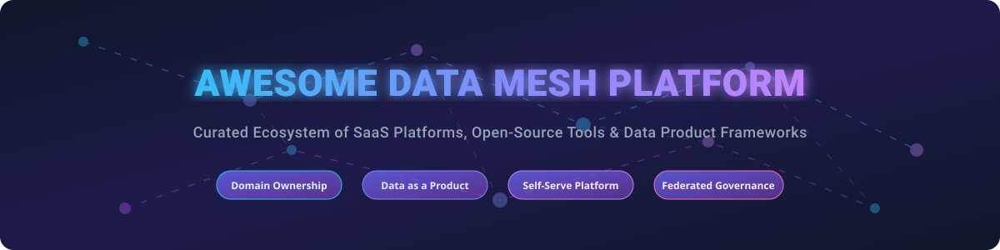

  

# 🌐 Awesome Data Mesh Platform 🚀

   

## 📌 Top Data Mesh Platforms & Ecosystem Directory 📊

**A comprehensive, curated guide to Enterprise SaaS platforms, Open-Source GitHub projects, and self-serve data architecture tools for modern Data Mesh implementations.**

*Empowering organizations with Domain-Oriented Data Products, Federated Computational Governance, Self-Serve Infrastructure, Metadata Cataloging, and Data Observability.*

---

## 📑 Table of Contents
- [💡 Data Mesh Market Overview & Insights](#-data-mesh-market-overview--insights)
- [🏢 SaaS & Commercial Platforms](#-saas--commercial-platforms)
- [🔓 Open-Source GitHub Projects](#-open-source-github-projects)
- [🏗️ Architectural Implementation Playbooks](#%EF%B8%8F-architectural-implementation-playbooks)
- [🤝 How to Contribute](#-how-to-contribute)
- [☕ Support & Sponsorship](#-support--sponsorship)
- [📈 Star History](#-star-history)
- [⚠️ Disclaimer](#%EF%B8%8F-disclaimer)

---

## 💡 Data Mesh Market Overview & Insights 📈

> **Market Valuation & Growth:** The global Data Mesh market is estimated at **$1.66 Billion to $1.95 Billion (2025–2026)** and is projected to surpass **$7.11 Billion by 2034**, expanding at a Compound Annual Growth Rate (CAGR) of **17.56%**.
>
> **Market Dynamics & Fragmentation:** The sector is **highly fragmented**, characterized by specialized best-of-breed providers across four primary layers: Active Metadata Catalogs (Collibra, Atlan), Federated SQL Engines (Starburst), Data Observability (Monte Carlo, Bigeye), and Lakehouse Management (Onehouse). While hyper-scalers and established enterprise governance giants hold significant valuation, open-source standards (DataHub, Trino, OpenMetadata) prevent single-vendor lock-in, creating a vibrant competitive landscape rather than a winner-take-all consolidation.

---

## 🏢 SaaS & Commercial Platforms 💼

The SaaS Data Mesh market includes enterprise platform providers evaluated below by company size (Revenue/Valuation), entry tier pricing, and free tier or trial availability:

| 🏢 Platform | 💰 Pricing (Starting Tier) | 🎁 Free Tier / Trial Limit | 📏 Company Size (Valuation / Revenue) | 📝 Description |
| :--- | :--- | :--- | :--- | :--- |
| **[Thoughtworks Data Mesh Accelerator](https://www.thoughtworks.com/)** | $150,000 / enterprise engagement | Consultation & assessment on request | **$1.8B Valuation / ~$1.2B Annual Revenue** | Consulting-led framework, reference architecture, and custom mesh accelerator tooling for enterprise adoption. |
| **[Collibra](https://www.collibra.com/)** | $170,000 / year (Enterprise Base) | 14-day full platform enterprise trial | **$5.25B Valuation / ~$150M+ ARR** | Enterprise data governance platform providing federated stewardship, data lineage, and policy enforcement. |
| **[Starburst / Starburst Galaxy](https://www.starburst.io/)** | $0.50 / Starburst Credit (Pay-as-you-go) | $500 free credit over 30-day trial | **$3.35B Valuation / ~$100M ARR** | Powered by Trino; federated SQL query engine enabling instant self-serve access across distributed domain stores. |
| **[Monte Carlo](https://www.montecarlodata.com/)** | $15,000 / year (Starter Tier) | 14-day enterprise trial on sample datasets | **$1.6B Valuation / ~$50M ARR** | Data observability platform offering end-to-end lineage, automated data quality tracking, and anomaly detection. |
| **[Atlan](https://atlan.com/)** | $24,000 / year (Team Tier) | 14-day full feature trial | **$750M Valuation / ~$40M ARR** | Active metadata catalog enabling collaborative discovery, governance, and data product documentation. |
| **[Onehouse](https://www.onehouse.ai/)** | $0.10 / vCPU hour (Cloud Managed) | 30-day free trial ($300 cloud credit) | **$100M+ Valuation ($43M raised)** | Managed Lakehouse service built on Apache Hudi/Iceberg supporting domain data products and open tables. |
| **[Acryl Data (DataHub Cloud)](https://www.acryldata.io/)** | $1,000 / month (Starter SaaS) | 14-day free trial of DataHub Cloud | **$80M+ Valuation ($21M raised)** | Managed SaaS platform built around Apache DataHub for active metadata control, lineage, and data product discovery. |
| **[Secoda](https://www.secoda.co/)** | $500 / month (Growth Tier) | Free Tier (Up to 5 users & 1,000 metadata tables forever) | **$50M+ Valuation ($16M raised)** | AI-powered data catalog and workspace designed for self-serve documentation and domain discovery. |
| **[Bigeye](https://www.bigeye.com/)** | $10,000 / year (Starter Tier) | 14-day free trial | **$50M+ Valuation ($19M raised)** | Enterprise data observability platform monitoring freshness, volume, and quality metrics across domain pipelines. |
| **[Nextdata](https://www.nextdata.com/)** | Custom enterprise quote (Private Beta) | Early access developer preview upon request | **Early Stage ($12M+ Seed/Series A)** | Native Data Mesh platform founded by Zhamak Dehghani for creating, publishing, and declaring data products. |
| **[DataKitchen](https://datakitchen.io/)** | $2,000 / month (Standard Tier) | 30-day trial of DataOps Automation Platform | **Growth Stage (Bootstrapped / Private)** | DataOps and mesh lifecycle management tool for pipeline orchestration, quality testing, and continuous delivery. |

---

## 🔓 Open-Source GitHub Projects 🛠️

Below is the curated list of key open-source building blocks underpinning modern self-serve data mesh architectures, sorted by GitHub star count:

* **[Trino](https://github.com/trinodb/trino)**  ⚡  
  *High-performance distributed SQL query engine for federated querying across distributed domain data sources without central data movement.*

* **[dbt-core](https://github.com/dbt-labs/dbt-core)**  🛠️  
  *The industry-standard SQL transformation framework used by domain engineering teams to build modular, version-controlled data products.*

* **[DataHub](https://github.com/datahub-project/datahub)**  🔍  
  *Extensible metadata platform for end-to-end data discovery, lineage, entity ownership, and data product definition.*

* **[Apache Iceberg](https://github.com/apache/iceberg)**  🧊  
  *High-performance open table format for huge analytic datasets enabling domain autonomy on shared object stores.*

* **[OpenMetadata](https://github.com/open-metadata/OpenMetadata)**  📖  
  *Unified metadata platform featuring built-in governance, data contracts, lineage, schemas, and data product domain abstractions.*

* **[OpenLineage](https://github.com/OpenLineage/OpenLineage)**  🕸️  
  *Open standard for operational lineage collection, tracking pipeline dependencies across domain boundaries.*

* **[Amundsen](https://github.com/amundsen-io/amundsen)**  🔎  
  *Data discovery and metadata engine created by Lyft to index data assets and map organizational domain ownership.*

* **[Great Expectations](https://github.com/great-expectations/great_expectations)**  ✅  
  *Shared data testing, validation, and documentation framework used by domain teams to guarantee data product SLAs.*

* **[Open Data Mesh Platform](https://github.com/opendatamesh-initiative/odm-platform)**  🏗️  
  *Open platform implementation dedicated to managing the end-to-end lifecycle of data products using standardized Data Product Descriptors.*

---

## 🏗️ Architectural Implementation Playbooks 📖

- **Catalog & Metadata Mesh:** Utilize **[DataHub](https://github.com/datahub-project/datahub)** or **[OpenMetadata](https://github.com/open-metadata/OpenMetadata)** as the discovery layer for domain registration and federated policy tagging.
- **Federated Access Layer:** Execute cross-domain queries in-place using **[Trino](https://github.com/trinodb/trino)** without centralizing underlying data.
- **Domain Transformation Pipelines:** Standardize domain data modeling and testing with **[dbt-core](https://github.com/dbt-labs/dbt-core)** and open storage formats like **[Apache Iceberg](https://github.com/apache/iceberg)**.
- **Data Quality & Contracts:** Declare data product SLAs and track operational lineage across pipelines using **[Great Expectations](https://github.com/great-expectations/great_expectations)** and **[OpenLineage](https://github.com/OpenLineage/OpenLineage)**.

---

## 🤝 How to Contribute 🌟

Contributions to enrich this Data Mesh ecosystem list are welcome! 

1. **Fork** this repository.
2. Add or update entries in `README.md` maintaining table and list formatting.
3. Ensure all descriptions are concise, objective, and accurately categorized.
4. Submit a **Pull Request** with a brief summary of additions.

Refer to the curated catalog guide at [Awesome-Awesome-Awesome](https://github.com/ishandutta2007/Awesome-Awesome-Awesome) for general list contribution standards.

---

## ☕ Support & Sponsorship 💖

If you find this Data Mesh ecosystem reference helpful in your platform engineering journey, please consider supporting the project:

- ⭐ **Star & Fork:** Give this repository a star on GitHub and share it with your team!
- 📢 **Spread the Word:** Share on LinkedIn, Twitter/X, and tech forums.
- ☕ **Buy Me a Coffee:** Support ongoing open-source curation and tool development via the [GitHub Sponsors Dashboard](https://github.sponsors/ishandutta2007).

---

## 📈 Star History 📊

---

## ⚠️ Disclaimer 📝

- This repository is a **community-curated compilation** for informational purposes and does not constitute formal technical architectural endorsement.
- Data Mesh is primarily an **organizational operating model**; software tooling enables self-serve capabilities but requires organizational commitment to succeed.
